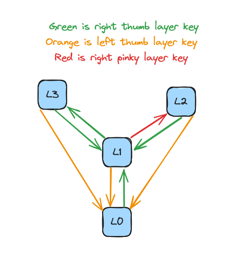

# Piantor 34 v1

This layout was my second layout. 
This layout uses "toggle on" layer keys as opposed to "momentary" layer keys, meaning I can simply tap a layer key and that layer will be activated until I tap a different key to move to another layer.
Other notable features are the Colemak-DH inspired layout, the homerow mods for `Super` and `Alt`, the hold behaviors for `/`, `.`, and `,` keys on the default layer, and the sticky keys for `Shift`, `Control`, and `Alt`.

### Layers
- `L0`: Default/Letters Layer
- `L1`: Symbols Layer
- `L2`: Arrows/BT Layer
- `L3`: Numbers/Media Layer

The layering system in this layout takes inspiration from Ben Vallack in order to create some ease when navigating the layers on the keyboard.
The various layers are connected as follows:

This layering system provides some ease-of-use when navigating the layers, particularly in these scenarios:

- Every layer that's not `L0` can return to `L0` by pressing the 'left thumb' layer key
- Because of the first point, and the fact that the 'right thumb' layer key always goes to a layer that's not `L0`, tapping the 'right thumb' and 'left thumb' layer buttons in sequence (green then orange arrows) will *always* return you to `L0`. This movement is easy, fast, and acts as a great "reset" when you lose track of the currently active layer
- The combinations for getting to `L2` ('right thumb' then 'right pinky') and `L3` ('right thumb' twice) both work in *almost every* situation, except when starting from `L1`

### Sticky Keys

The "sticky" `Control` and `Shift` keys, as well as sticky `Alt` on `L1`-`L3`, are indicated in the diagram with the `-Key-` syntax. 
These keys can be tapped, and then will be used to Mod the *next* tapped key (timeout is 1 sec). 
This allows for capitalizing letters or entering common `Control` commands (e.g. `Control`+`C`) without having to hold down a key and contort one's hands, but instead do a "rolling" action.

### Homerow Mods

There are only two homerow mods on this layout, one for `Super` under the index finger, and one for `Alt` under the middle finger.