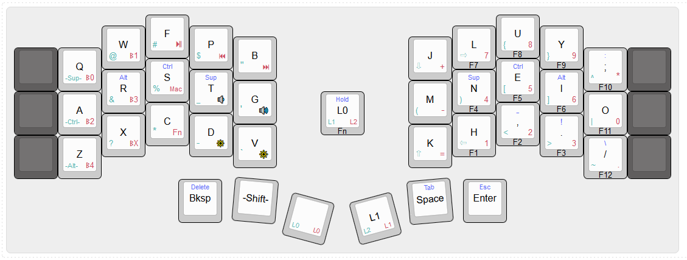
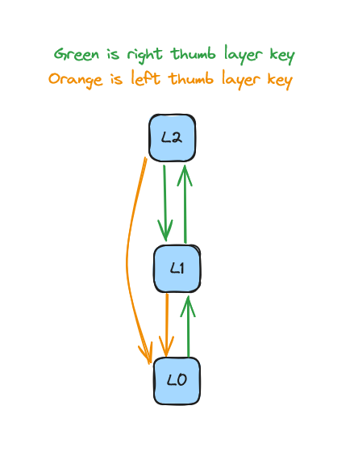

# Piantor 36 v1

This layout is my third and current layout. 
It is fairly similar to the [Piantor 34 v1](../../piantor-34/layout-1/README.md) layout which I used previous to this one, with some notable differences. 

- The usage of Colemak-DH was corrected to be 100% accurate to the standard, which involved moving around some of the punctuation symbols on `L0` and moving `Backspace` out of the upper rows.
- The Homerow Mods were expanded to include `Super` and are implemented on every layer
- Added back the outer thumb keys, increasing the key count to 36 keys. This lead to a complete redo of the thumb keys to make use of the extra keys
- Used the space savings from the new thumb keys to reduce from 4 total layers (`L0`-`L3`) to 3 layers (`L0`-`L2`)  

### Layers
- `L0`: Default/Letters Layer
- `L1`: Symbols/Arrows Layer
- `L2`: Media/BT Layer

The various layers are connected as follows:

This layering system provides some ease-of-use when navigating the layers, particularly in these scenarios:

- Every layer that's not `L0` can return to `L0` by pressing the 'left thumb' layer key
- Because of the first point, and the fact that the 'right thumb' layer key always goes to a layer that's not `L0`, tapping the 'right thumb' and 'left thumb' layer buttons in sequence (green then orange arrows) will *always* return you to `L0`. This movement is easy, fast, and acts as a great "reset" when you lose track of the currently active layer

### Sticky Keys

The "sticky" `Shift` key on the thumb row, as well as the "sticky" `Super`, `Control`, and `Alt` keys on `L1`, are indicated in the diagram with the `-Key-` syntax. 
These keys can be tapped, and then will be used to Mod the *next* tapped key (timeout is 1 sec). 
This allows for capitalizing letters or entering common Control commands (e.g. `Control`+`C`) without having to hold down a key and contort one's hands, but instead do a "rolling" action.

### Homerow Mods

There are three homerow mods on this layout:
- `Super` under the index finger
- `Control` under the middle finger 
- `Alt` under the ring finger

All of these mods are available on every layer.